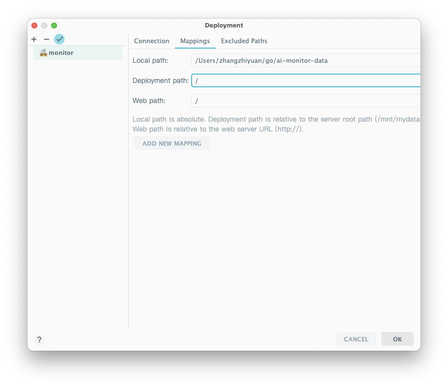

# Gitbook

# 同步github和gitbook内容
&#x20;<mark style="color:orange;">怎样将github和gitbook绑定起来</mark>

**选择所有的项目**， ~~选择单个项目~~

* 当gitbook中的内容更新 -> github代码更新 -> gitbook的在线文稿预览更新

<figure><figcaption></figcaption></figure>

# 其他用法