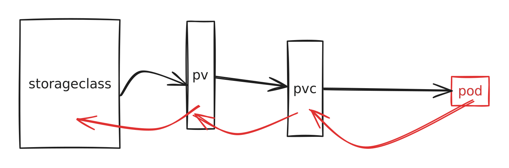

# 过滤器

## js第三方的库

[BootCdn](https://www.bootcdn.cn/) 怎么使用

## 过滤器

### 接收的参数

表面为N个， 其实是N+1个

多个过滤器的串联：就像是linux中的grep

局部过滤器filters， 全局过滤器filter

差值语法 / v-bind

## 组件

组件 一个组件就是一个微型的vm

## 内置指令

diff 自定义指令

## cookie

七天免登录的原理

为什么只输入一次账号密码

跨浏览器读取cookie是不可行的

插件 cookie editor

v-html 和 XSS攻击（冒充用户之手）

## 浏览器调试方法

